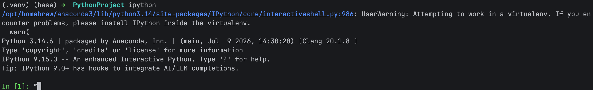
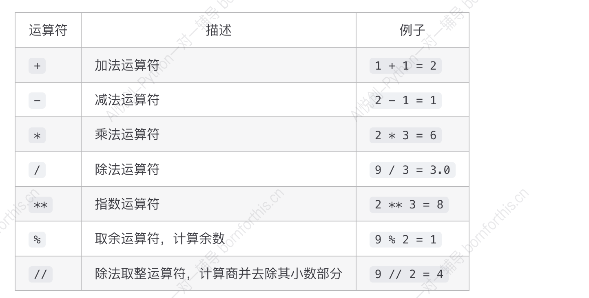
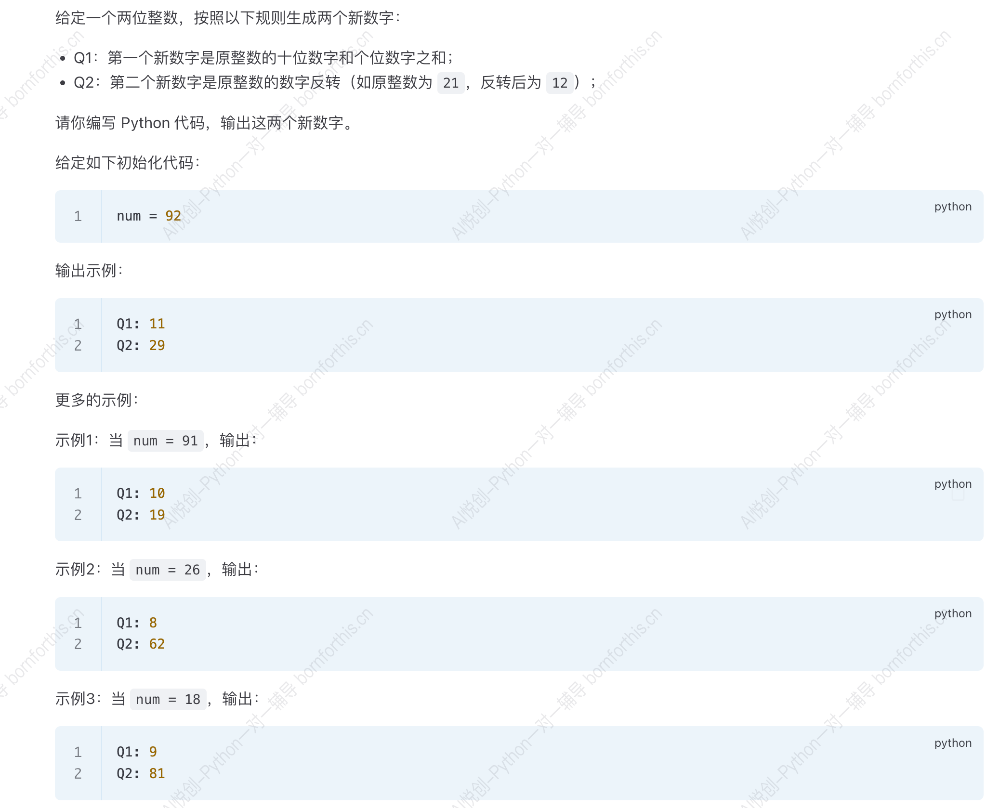
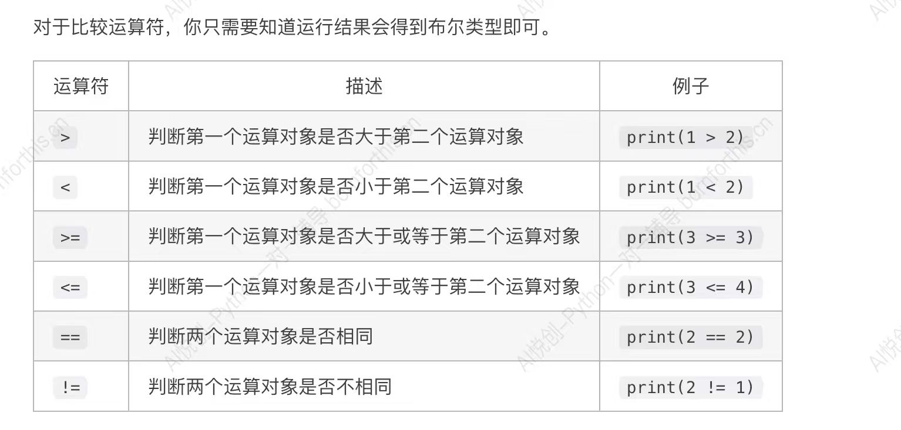
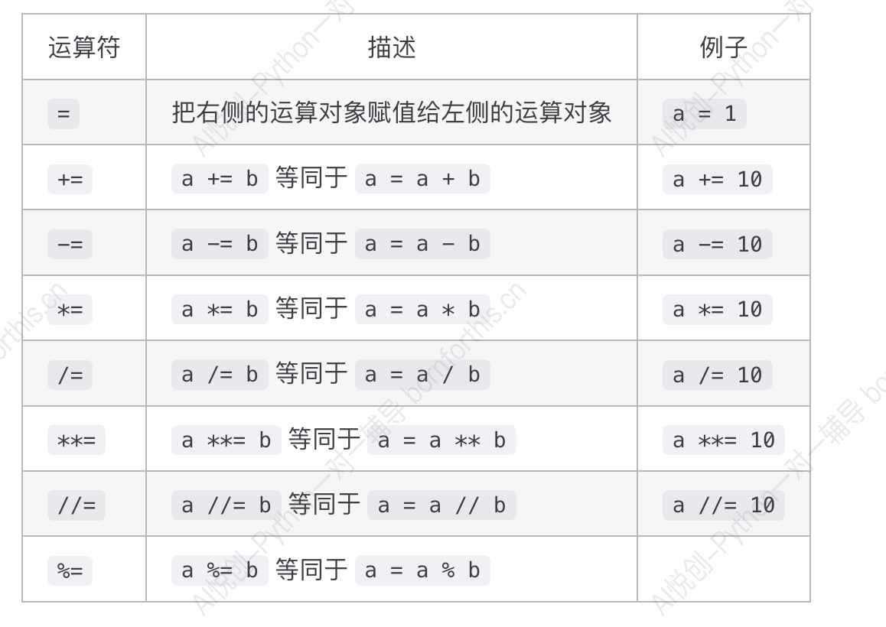

# 1.安装并激活 ipython




# 2. 结论

```python
In [1]: 1+1
Out[1]: 2

In [2]: 1+1.0
Out[2]: 2.0

In [3]: 2-1.0
Out[3]: 1.0

In [4]: 2-1
Out[4]: 1

In [5]: 2*3
Out[5]: 6

In [6]: 2*3.0
Out[6]: 6.0

In [7]: 9/3
Out[7]: 3.0

```

> In [8]: # 结论 1：如果其中有一个元素是浮点数，结果就会得到浮点数（优先级最高）
>
> In [9]: # 结论 2：除法涉及精度问题，所以最后的结果类型：就是浮点数。
>
> 使用场景：可以放入测试代码。

# 3. 算数运算符





```python
num=27
print("Q1:",num//10+num%10,sep='')
print("Q2:",num%10,num//10,sep='')
```

# 4. 比较运算符



# 5. 赋值运算符



```python
In [9]: a=1
   ...: a+=10
   ...: a-=10
   ...: a*=10
   ...: a/=10
   ...: a**=10
   ...: a//=10
   ...: 
   ...: print(a)
0.0
```

```python
In [12]: x=4.5
    ...: y=2
    ...: print(x//y)
2.0
```
