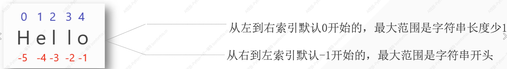

---

slug: 04-数字型
catalogNo: F-005
date: 2026-08-16
createdAt: 2026-10-01T01:14:39.613Z
summary: python学习
category: 笔记
tags: [环境搭建, 项目搭建]
featured: false
---

# 1. 字符串的定义



# 2. 创建字符串

## 2.1 基础创建

```python
name='sdhuhuhds'
number="18"
paragrapg= '''Hello,sdoshodhoi!
sdbaiusbdiuas!'''
paragrapgtwo="""sdsduiagsiudgu!
usdasuhdua!"""
```

1. 多行文本只支持三个单引号和双引号

```python
In [14]: name ='hellsda9sudg\
    ...: \
    ...: sdsadasd\
    ...: asdauosdgoausgdsad'
    ...: print(name)
hellsda9sudgsdsadasdasdauosdgoausgdsad
```

> 变为单行文本

2. 若需要用到单引号，那就只能用双引号，单双引号混用

```
string= "I'm lilei"
```

3. 可实现多行输出三单双引号，可实现文本原样输出

```python
string= """我们有时候不仅仅要看选择项以内的答案，也要去思考选择项以外的答案。——AI悦创

浅者见浅，深者见深——黄家宝

起的最早的是理想主义者，跑的最快的是骗子，而胆子最大的是那些冒险家，害怕错过一切，疯狂往里冲的是韭菜，而真正的成功者，可能还没有入场。

先实现功能，再去优化，否则一切会很乱。——AI悦创

凡是你不能清晰写下来的东西，都是你还没有真正理解的东西"""
```

# 3. 检测字符串长度

```python
sdoshudoi="uyyguyg"
print(len(sdoshudoi))
```

# 4. 字符串中的字符获取

## 4.1字符串中的单个字符获取

```python
sdoshudoi="bornforthis"
print(sdoshudoi[-1])
print(sdoshudoi[10])
print(sdoshudoi[len(sdoshudoi)-1])
```

## 4.1  提取多个连续字符

```python
string="bornforthis"
print(string[4:7])
print(string[7:11])
```

## 4.2 提取等间隔的字符

```python
number="0123456789"
string='bornforthis'
print(number[1:10:2])
print(string[0:100:3])
print(string[1:100:3])
```

## 4.3 优化

```python
number="0123456789"
string='bornforthis'
print(number[1:10:2])
print(string[::3])
print(string[1::3])
```

## 4.4 字符串的倒序

```python
print(string[::-1])
```
