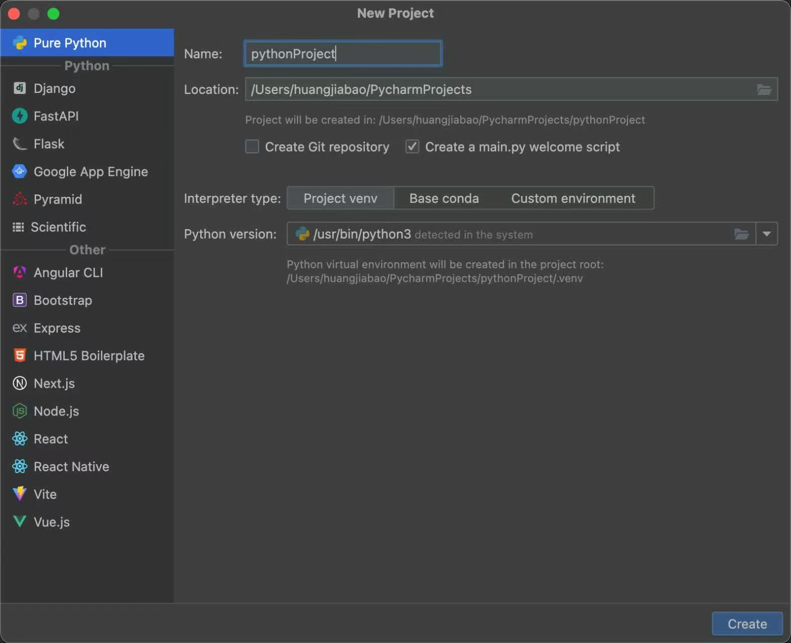
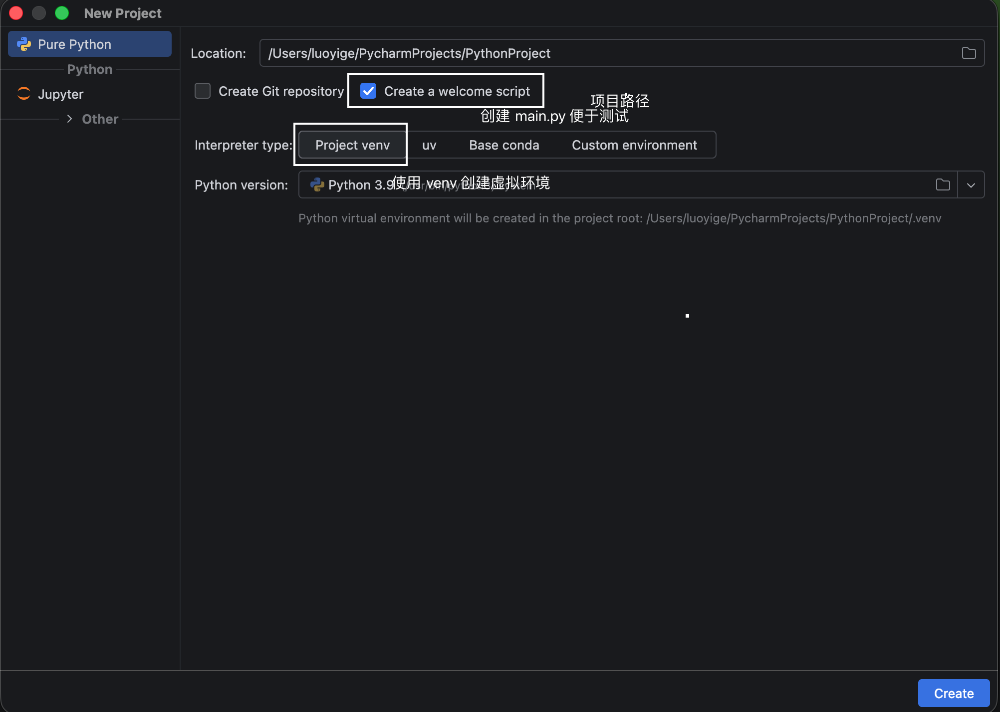
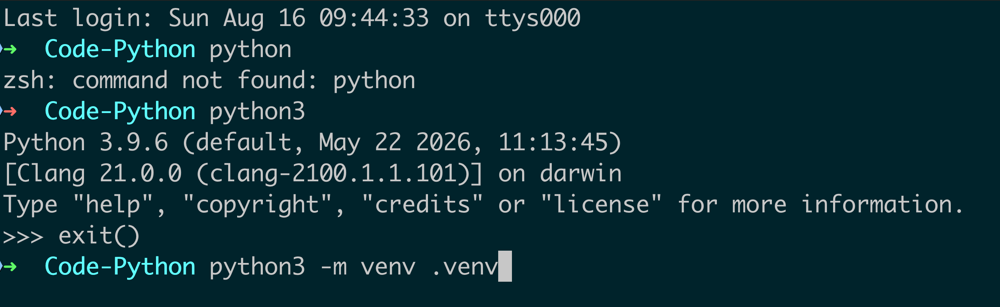
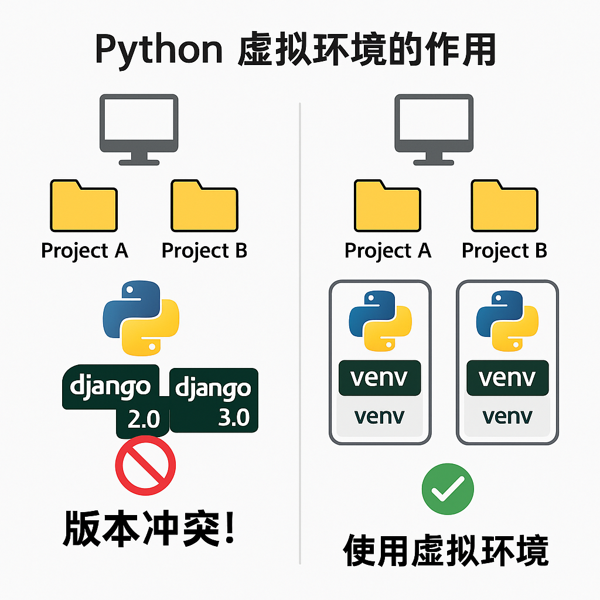
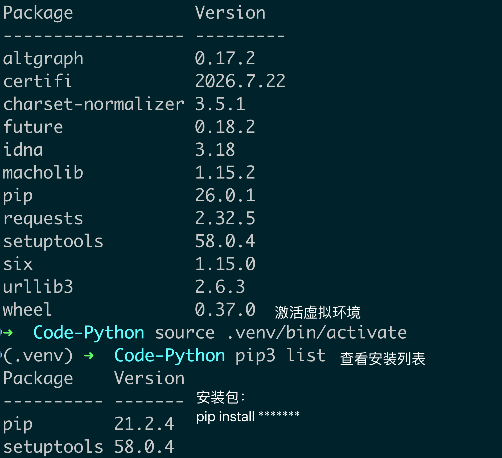
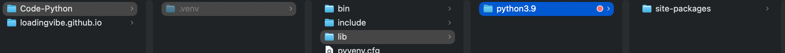

# 1. 打开 PyCharm

# 2. 设置项目相关信息

# 3. 新建项目的三个方法

## 3.1 利用终端

- 创建虚拟环境

**注：虚拟环境的作用**

- 激活虚拟环境前后的安装包的对比

# 4. 快捷指令

- command+/：查看源码（typora）

- command+shift+。：查看隐藏文件夹

  

- ls -la：查看当前路径下所有文件或文件夹包括隐藏文件
- -+空格：黑点
- Pip list:查看当前安装了什么包
- deactivate:推出虚拟环境
