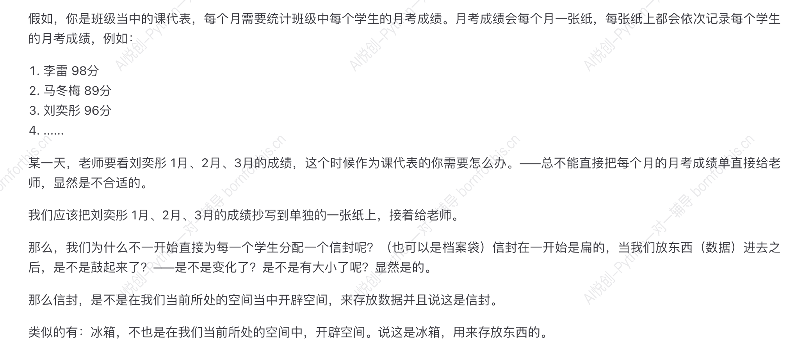
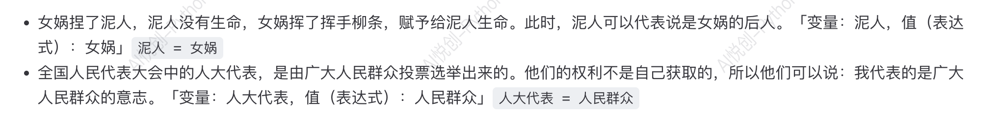

# 1. 理解变量——生活中的例子

## 1.1 从字面意思理解

- 变：变化
- 量：大小

## 1.2 举个例子

——所以，变量不就是在计算机的内存中开辟空间，来存储数据。

## 1.3 变量的特点

特点：变量会被覆盖，只会保存最后一个

# 2. 如何创建变量——赋值语句

1. 变量：通过变量名代表或应用某个值

2. 初始化赋值语句：**变量名+表达式**「`=`叫做：赋值运算符」

- 变量名：就是这个空间，我们叫它什么名字；
- 表达式；类似数学表达；

程序的运行逻辑：**从上到下，从左到右（这里的右指的是先执行=“右边的整体”），最后才是赋值。**

- debug：找到代码所存在的问题，怎么着？——用大脑运行代码，并带着期待的结果进行对比。（也就是：期待（原本应该是什么及结果、逻辑），实行大脑运行时的逻辑）

