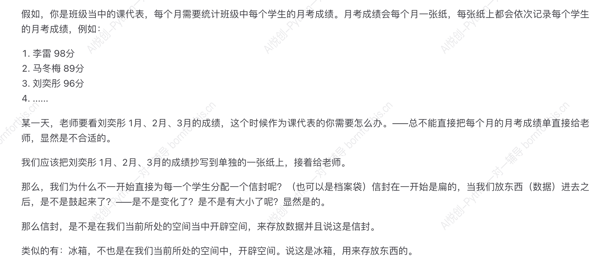
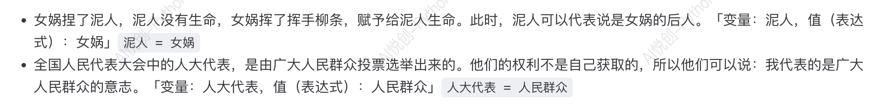
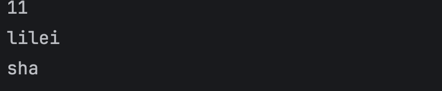
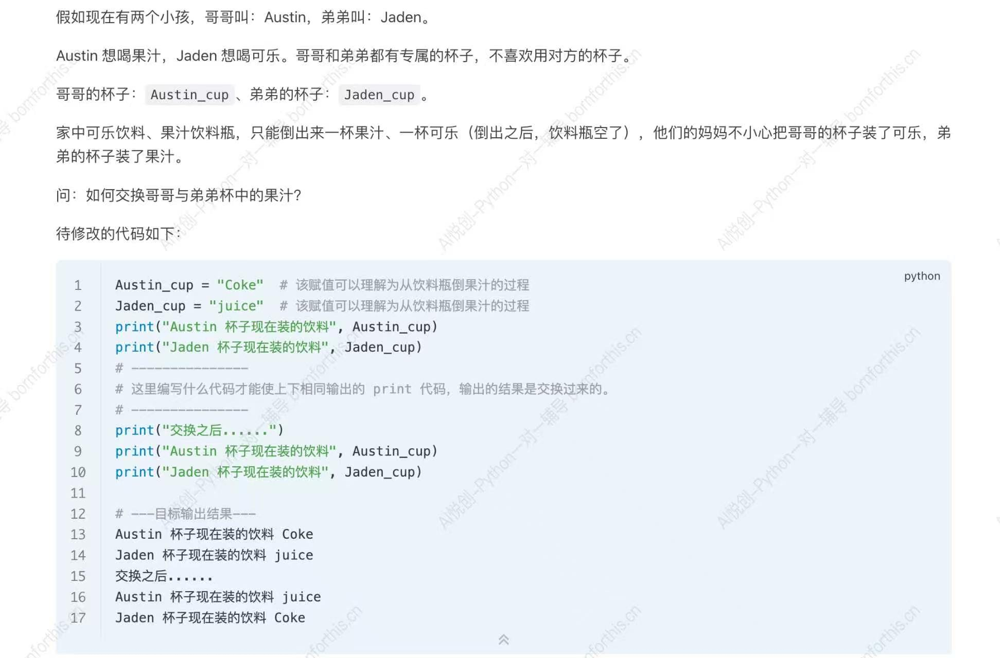

# 1. 理解变量——生活中的例子

## 1.1 从字面意思理解

- 变：变化
- 量：大小

## 1.2 举个例子



——所以，变量不就是在计算机的内存中开辟空间，来存储数据。

## 1.3 变量的特点

特点：变量会被覆盖，只会保存最后一个

# 2. 如何创建变量——赋值语句

1. 变量：通过变量名代表或应用某个值



2. 初始化赋值语句：**变量名+表达式**「`=`叫做：赋值运算符」

- 变量名：就是这个空间，我们叫它什么名字；
- 表达式；类似数学表达；

程序的运行逻辑：**从上到下，从左到右（这里的右指的是先执行=“右边的整体”），最后才是赋值。**

- debug：找到代码所存在的问题，怎么着？——用大脑运行代码，并带着期待的结果进行对比。（也就是：期待（原本应该是什么及结果、逻辑），实行大脑运行时的逻辑）

举例:

```python
x=1 # 1赋值给x
x=x+10 # 将x增大10，变成11赋回给x
print(x) # 打印出来
```

```python
name1="lilei"
name2=name1
print(name2)
# 变量的值的传递
name1="sha"
print(name1)
#变量的覆盖
```



# 3. 探究 print

## 3.1 同时输出多个数据

```python
a=1
b=2
c=3
print(a,b,c)#同时输出多个变量
```

## 3.2 sep 修改多个变量输出的间隔

```python
a="李雷"#不同类型
b=2
c=3
print(a,b,c,sep='是')
```

**若仅有一个变量，sep 无作用。**

## 3.3 end 修改 print 输出结尾的方式

```python
a=1
b=2
c=3
print(a,end='\n\n')
print(b,end='\n\n')
print(c,end='\n\n')
```

## 3.4 end 和 end 可以同时使用

```python
a=1
b=2
c=3
print(a,b,c,sep='好',end='不好')
```

## 3.5 print 输出可以有提示的

```python
a="a 的值是："
c=1
print(a,c)
```

# 4. 进阶的赋值方法

## 4.1 多个变量同时赋相同的值

```python
a=b=c=1
print(a,b,c)
```

## 4.2 多个变量同时赋不同的值

```python
a,b,c=1,2,3
print(a,b,c)
```

## 4.3 交换果汁



```python
a=Austin_cup
Austin_cup=Jaden_cup
Jaden_cup=a
```

```python
Austin_cup,Jaden_cup=Jaden_cup,Austin_cup
```

# 5. 变量命名规则

规则如下：

- 大小写、数字和 __的结合，且不能用数字开头

- 系统关键词不能做变量名使用，若想知道可输出：`help("help keywords")`

  ```python
  False               break               for                 not
  None                class               from                or
  True                continue            global              pass
  __peg_parser__      def                 if                  raise
  and                 del                 import              return
  as                  elif                in                  try
  assert              else                is                  while
  async               except              lambda              with
  await               finally             nonlocal            yield
  ```

- 区分大小写

- 变量名中不能有空格，用__来分割

- 不要用 Python 的内置函数名称做变量

```
int =10
print(int)
int('1')
```

