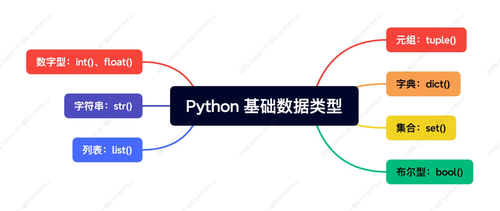

# 1.数字型「int、float」

1. 整型

```python
int_num=1
t=type(int_num)
print(int_num)
print(t)
print(type(int_num))
```

2. 浮点数

```python
float_num=1.5
t=type(float_num)
print(float_num)
print(t)
print(type(float_num))
```

# 2. 字符串「str」

## 2.1 代码举例

```python
string =("hello world")
t=type(string)
print(type(string))
print(t)
```

## 2.2 字符串三大特征

1.  有序性
   1. 从左到右，下标是从 0 开始；
   2. 从右到左，下标都是从 -1 开始的；
   3. 引号里面出现的每个字符都算一个下标；
2. 不可变性
   1. 不同的编程语言处理字符串的方式可能有所不同，但在大多数语言中，字符串都是不可变的，这意味着一旦创建，字符串的内容就不能改变。
   2. 注意：我们说的不可辨是指在代码运行过程中，不能对字符串修改、添加、删除之类的操作；
3. 任意字符
   1. 键盘上可以输入的字符，都是字符串的元素
   2. 字符放到字符串中，都将成为字符串类型「每个元素称之为（子字符串）」

# 3. 列表「list」

## 3.1代码举例

```python
lst =["hello",1,1.1,("look","look"),[12,"好的"],True]
t=type(lst)
print(type(lst))
print(t)
```

## 3.2 列表的三大特征

1.  有序性
   1. 从左到右，下标是从 0 开始；
   2. 从右到左，下标都是从 -1 开始的；
   3. 列表里的元素算一个：
      1. 比如：`lst=["look",12];`
         1. `look`是下标0，也是下标-2；
         2. `12`的下标是1，也是下标-2；
2. 可变性：在程序运行的过程中，列表可以改变添加、删除、修改
3. 任意数据类型：任意python所拥有的数据类型均可

**思考一下：列表的下标和字符串的下标有什么区别**

>  列表是一个整体块为一个字元素，以这个为单位标记下标

# 4. 元组「tuple」

## 4.1 代码举例

```python
tup =(1,2,3,4,"aiye",1.1,[1,2,3,4])
t=type(tup)
print(type(tup))
print(t)
```

## 4.2 元组的三大特征

1.  有序性
   1. 从左到右，下标是从 0 开始；
   2. 从右到左，下标都是从 -1 开始的；
   3. 列表里的元素算一个：
      1. 比如：`tup=（"look",12）;`
         1. `look`是下标0，也是下标-2；
         2. `12`的下标是1，也是下标-2；
2. 不可变性
   1. 元组创建出来，就不能改变；
   2. 注意：我们说的不可辨是指在代码运行过程中，不能对字符串修改、添加、删除之类的操作；
3. 任意数据类型:任意python所拥有的数据类型均可

# 5. 列表和元组到底用哪一个？

列表里面放元组，根据不可变和可变选择适当的结构

> 如一对经纬度用元组，很多经纬度可以用列表收集

元组不浪费空间，列表浪费一定空间

# 6. 字典「dict」

## 6.1 代码举例

```python
d={"name":"aiye","age":18,1:"int",1.1:1,"tup":(1,2,3)}
t=type(d)
print(type(d))
print(t)
```

## 6.2 字典的三大特征

1. 无序性「Python 3.6+ 后有序」

   1. 字典的有序，并不是上面（字符串、列表、元组……）的那种常规有序；

   2. 字典的有序是指：字典中的键值对是有序的，有序前期基本用不到；

      （在同一个代码运行过程中，字典的键值对的顺序是固定的）

2. 字典的组成：是由一系列的 key 和 value 组成。`d={"key1":"c=value1","key2":"value2"……}`

3. key:

   1. 不可变的数据类型，才可以当做字典的key；

比如：字符串，元组，数字型，布尔型，

列表、字典、集合都不可以作为 key

4. value: 任意数据类型，python 所拥有的数据类型；
5. 可变性：可以添加、修改删除键值对；
